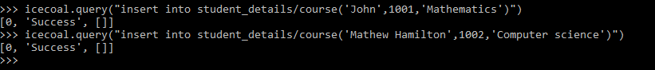
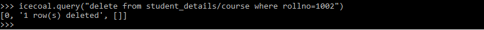
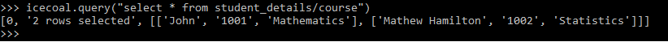
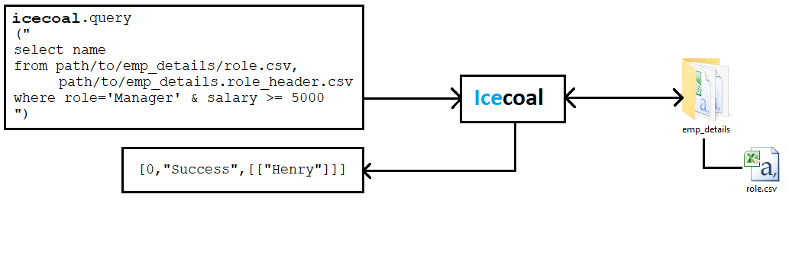
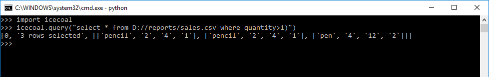

# Icecoal
Icecoal is a light weight SQL database

Targets are,
- Apps that require SQL DB or external DB server
- Apps that need lightweight replacement for oracle, MySQL etc.., which they use just to store and retrieve data
- Those who want to add a database in their app without worrying about any technical jargons such as JDBC, ODBC, Connection driver etc..
- Those who want to conveniently process CSV files with SQL.

### Features:
- Written purely in python
- Light weight (Just 57 Kb in total)
- No external dependencies
- Easy to add in your app/system (Just import!)

### Demo


### In action
#### Create a Database

#### Create a table

#### Insert a row in a table

#### Update a row in a table

#### Delete a row in a table

#### Select rows from a table

#### Truncate a table

#### Drop a table

#### Drop a database


#### Processing csv files with SQL




### How to install
```
pip install icecoal
```

### Usage
#### General database operations
```python
from icecoal import query
query("select name,age from travel_db/passengers where native='USA'")
```
#### Example
```python
from icecoal import query

def display_names():
    display_query="""
    select
        name, age
    from
        student_db/courses
    where 
        mark>50
    """
    
    result = query(display_query)
    if result[0]==0:
        for row in result[2]:
            print("Name is "+row[0]+" and Age is "+row[1])
    else:
        print(result[1])
       
display_names()
```
#### Processing your csv data files
```python
from icecoal import query
query("select * from path/to/passengers.csv where native='USA'")
```
Here icecoal expects first line of csv file to be header line.    
if it is not, you can either add headers in first line    
or create a new file just with headers delimited with comma and add it along with data file name in the query as below    
```python
from icecoal import query
query("select * from path/to/passengers.csv, path/to/header.csv where native='USA'")
```
#### Example
```python
from icecoal import query

def display_names():
    display_query="""
    select
        price
    from
        D://reports/sales.csv, D://reports/header.csv
    where 
        store='online'
    """
    
    result = query(display_query)
    if result[0]==0:
        for row in result[2]:
            print("Price : "+row[0])
    else:
        print(result[1])
       
display_names()
```

#### Change delimiters other than comma
This feature is to expand users ability to process files that are delimited with chatacters other than comma.
```python
from icecoal import setdel,query
setdel("\t")
query("select * from path/to/datafile.xyz")
```
`setdel()` function will make further calls to query function to interpret data file as custom delimited (which is given by `setdel()` parameter)

#### Get current default delimiter
```python
from icecoal import getdel
getdel()
```
`getdel()` function will return current delimiter which is used to process data files.

### Return format
```
[sqlcode,'<message>',[result list]]
```
### SQL return codes
| SQL Code | Description |
| --- | --- |
| 2 | 0 row\(s) deleted |
| 3 | 0 row\(s) updated |
| 1 | 0 row\(s) selected |
| 0 | **Success** |
| -1 | Query incomplete |
| -2 |  Unexpected character on position \<index\> |
| -3 |  Unexpected character on where clause position \<index\> |
| -4 |  Unsupported operator in where clause |
| -5 |  Non numeric operand with arithmatic operator \<operator\> |
| -6 | Non boolean operand(LHS) with logical operator \<operator\> |
| -7 | Non boolean operand(RHS) with logical operator \<operator\> |
| -8 | Operator ! must be followed by = |
| -9 | Unbalanced paranthesis on LHS of operator \<operator\> |
| -10 | Unbalanced paranthesis on RHS of operator \<operator\> |
| -11 |  No field \<fieldname\> found in header file |
| -12 | Value for variable \<variablename\> is missing in atleast one row |
| -13 | Where clause condition returns non-boolean result |
| -14 | Incomplete condition in where clause |
| -15 | Database already exist |
| -16 | Table already exist |
| -17 | Database does not exist |
| -18 | Database name is blank |
| -19 | Not a database name |
| -20 | Table does not exist |
| -21 | Not a table name |
| -22 | Header file does not exist |
| -23 | Provided header is not a file |
| -24 | Values count does not match table fields count |
### Reserved words
| Keywords |
| --- |
| SELECT |
| FROM |
| WHERE |
| CREATE |
| DATABASE |
| TABLE |
| INSERT |
| UPDATE |
| SET |
| INTO |
| TRUNCATE |
| DROP |
| DELETE |

### Supported SQL operations and its syntax
* SELECT *column_list* FROM \[*path/to/*]*databasename/tablename*\[*.csv*] \[WHERE *condition*]
* CREATE DATABASE \[*path/to/*]*databasename*
* CREATE TABLE \[*path/to/*]*databasename/tablename*\[*.csv*](*colum1,column2..*)
* DROP DATABASE \[*path/to/*]*databasename*
* DROP TABLE \[*path/to/*]*databasename/tablename*\[*.csv*]
* TRUNCATE TABLE \[*path/to/*]*databasename/tablename*\[*.csv*]
* INSERT INTO \[*path/to/*]*databasename/tablename*\[*.csv*](*value1,value2,..*)
* UPDATE \[*path/to/*]*databasename/tablename*\[*.csv*] SET *field1=value1,field2=value..* \[WHERE *condition*]
* DELETE FROM \[*path/to/*]*databasename/tablename*\[*.csv*] WHERE *condition*

### Operators supported
| Operator type | Operators |
| --- | --- |
| Arithmatic operators | +, -, *, /, % |
| Comparison operators | >, <, >=, <=, =, != |
| Logical operators | &, \| |
| End of query statement | \# (Used internally) |

### Operator precedence (in order from high to low)

**NOTE :** Expression evaluation will use BODMAS as you studied in school. i.e., It has individual operator precedence unlike python or java.   
**Example :** '9-7+1' will result '1'(That's how we were taught in school), where python eval() will return 3 as it treats + and - with equal precedence from left to right

*You can use paranthesis to re-order precedence*

| Operator precedence |
| :---: |
| \% |
| \/ |
| \* |
| + |
| \- |
| <,<= |
| \>,>= |
| != |
| = |
| & |
| \| |

### File formats supported
Comma seperated value(.csv) files by default.    
Can be extended to support any files with `setdel()` function. for example to process tab seperated files, use `setdel("\t")` before executing `query("...")`

### Instructions
* Tables are referred with '/' character from database like 'db/table'
* String values should be within '<string>'
* Comparison operator '=' is used instead of '=='
* Database,table names can contain only alphabet, number and underscore
* Field names can contain only alphabets,number and underscore
* All the exceptions are thrown to be handled by users
* By default icecoal stores all its databases in current directory unless you prefix path with tablename
 
### Licence
MIT Licence. Please raise a pull request to contribute.
